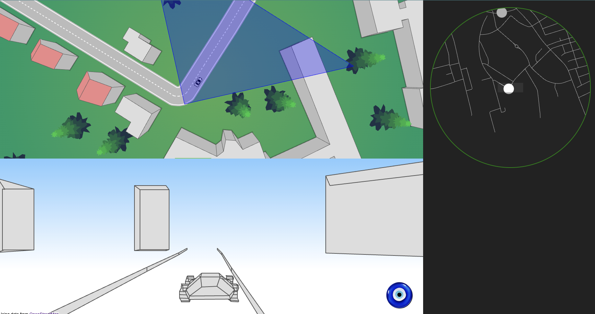

# Virutal world in JavaScript from scratch

A virtual world in JavaScript from scratch. 
This project try to simulate a virtual world similar to google maps using only vanilla JavaScript. 
The project offer the top view of the world and the 3D view of the world(street view like).  

## Live Demo
 - Access the live demo [here](https://apssouza22.github.io/3d-virtual-world/)




## generate the map from your location
 - Access https://overpass-turbo.eu/
 - Query 
```
[out:json];
   (
   way["highway"]
   ({{bbox}});
   );
   out body;
>;
out skel;
```

## Decode the map
 - Save the generated map as `myMap.js` in the `data` folder. See examples
 - Make sure to assign the generated map data to `myMap` variable  in the myMap.js file
 - Run `createAndSaveWorld();` to generate the world data
 - save the generated world data as `myWorld.js` in the `data` folder
 - Make sure to assign the generated world data to `worldData` variable  in the myWorld.js file
 - add the myWorld.js to the index.html file
 - Run the index.html file in the browser